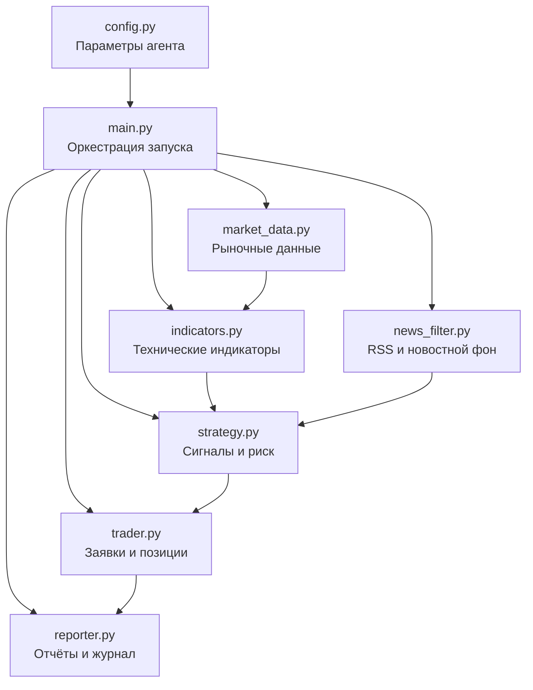

# Trading Agent

[](https://www.python.org/)
[](https://developer.tbank.ru/invest/)
[](LICENSE)
[](#статус-проекта)

Алгоритмический торговый агент на Python для анализа российского фондового рынка через T-Invest API.

Проект получает рыночные данные, рассчитывает технические индикаторы, анализирует новостной фон, формирует торговые сигналы, контролирует риск, выставляет заявки в песочнице и сохраняет отчёты о работе.

> **Важно:** проект является учебным прототипом. Он не является инвестиционной рекомендацией и не готов к торговле реальными деньгами без дополнительного тестирования, бэктеста и доработки обработки нештатных ситуаций.

## Возможности

- получение исторических свечей и данных по инструментам через T-Invest API;
- расчёт EMA 20, EMA 50, EMA 200, ATR и momentum;
- фильтрация инструментов по ликвидности и спреду;
- среднесрочная трендовая стратегия;
- поиск входов на откате и пробое;
- рыночный фильтр по индексу IMOEX;
- новостной фильтр на основе RSS-источников;
- ограничение риска на сделку и размера позиции;
- ограничение числа одновременно открытых позиций;
- секторная диверсификация;
- частичная фиксация прибыли;
- защитные инструменты при неблагоприятном рынке;
- режим анализа без выставления заявок (`--dry-run`);
- работа в песочнице T-Invest;
- ежедневные отчёты и CSV-журнал сделок;
- автоматический запуск на Linux/VPS.

## Архитектура



## Структура проекта

```text
Trading-agent001/
├── .env.example
├── .gitignore
├── config.py
├── indicators.py
├── main.py
├── market_data.py
├── news_filter.py
├── reporter.py
├── requirements.txt
├── strategy.py
└── trader.py
```

## Как работает агент

1. Проверяет конфигурацию и токен.
2. Подключается к T-Invest API.
3. Оценивает состояние рынка по IMOEX.
4. Загружает свечи по инструментам из списка наблюдения.
5. Рассчитывает EMA, ATR, momentum и другие показатели.
6. Проверяет ликвидность, спред и новостной фон.
7. Ищет сигналы по правилам стратегии.
8. Рассчитывает размер позиции и защитные уровни.
9. В обычном режиме выставляет заявки в песочнице.
10. Формирует отчёт и обновляет журнал сделок.

## Торговая логика

### Рыночный фильтр

Перед анализом отдельных бумаг агент оценивает общее состояние рынка. Фильтр помогает не открывать обычные длинные позиции при неблагоприятной динамике индекса.

### Тренд

- EMA 20 — краткосрочная динамика и откат;
- EMA 50 — среднесрочный тренд;
- EMA 200 — глобальное направление.

### Сигналы

Стратегия учитывает откат или пробой, расстояние до сопротивления, дневное движение, спред, ликвидность и соотношение потенциальной прибыли к риску.

### Волатильность и защитные уровни

ATR используется для адаптивного расчёта стоп-лосса. Размер позиции ограничивается так, чтобы потенциальный убыток не превышал установленную долю капитала.

### Новостной фильтр

RSS-ленты оцениваются по набору позитивных и негативных ключевых слов. Это дополнительное эвристическое ограничение, а не полноценный анализ событий.

## Риск-менеджмент

| Параметр | Значение по умолчанию | Назначение |
|---|---:|---|
| `INITIAL_CAPITAL` | 50 000 ₽ | расчётный стартовый капитал |
| `MAX_RISK_PER_TRADE` | 1% | максимальный риск на сделку |
| `MAX_POSITION_SIZE` | 30% | максимальная доля одной позиции |
| `MIN_CASH_RATIO` | 30% | минимальная доля свободных средств |
| `MAX_POSITIONS` | 2 | максимальное число открытых позиций |
| `MAX_DRAWDOWN` | 7% | порог остановки торговли |
| `MIN_RISK_REWARD` | 2.0 | минимальное соотношение прибыль/риск |

Дополнительно агент ограничивает секторную концентрацию и проверяет ликвидность, спред и дневное движение цены.

## Требования

- Python 3.11 или новее;
- Git;
- токен T-Invest API;
- Linux, macOS или Windows;
- для автоматического запуска — Linux/VPS с `cron` или `systemd`.

## Установка

```bash
git clone https://github.com/kardanov001/Trading-agent001.git
cd Trading-agent001
python3 -m venv venv
source venv/bin/activate
python -m pip install --upgrade pip
pip install -r requirements.txt
```

Windows PowerShell:

```powershell
python -m venv venv
venv\Scripts\Activate.ps1
pip install -r requirements.txt
```

## Переменные окружения

```bash
cp .env.example .env
```

Минимальная конфигурация:

```env
TINKOFF_TOKEN=ваш_токен
TRADING_MODE=sandbox
```

Не добавляйте `.env` в Git и не публикуйте токен.

## Первый запуск

Настройка песочницы:

```bash
python main.py --setup
```

Анализ без заявок:

```bash
python main.py --dry-run
```

Запуск с заявками в песочнице:

```bash
python main.py
```

Перед обычным запуском убедитесь, что в `.env` указан режим песочницы.

## Отчёты

```text
reports/
├── daily/
├── weekly/
├── trades.csv
└── cron.log
```

Каталог создаётся во время работы и не должен храниться в репозитории.

## Автоматический запуск на VPS

Пример cron по будням в 19:00:

```cron
0 19 * * 1-5 cd /home/user/Trading-agent001 && /home/user/Trading-agent001/venv/bin/python main.py >> reports/cron.log 2>&1
```

Пример `systemd`-сервиса:

```ini
[Unit]
Description=Trading Agent
After=network-online.target
Wants=network-online.target

[Service]
Type=oneshot
User=user
WorkingDirectory=/home/user/Trading-agent001
EnvironmentFile=/home/user/Trading-agent001/.env
ExecStart=/home/user/Trading-agent001/venv/bin/python main.py
```

Пример таймера:

```ini
[Unit]
Description=Run Trading Agent on weekdays

[Timer]
OnCalendar=Mon..Fri 19:00
Persistent=true

[Install]
WantedBy=timers.target
```

## Настройка стратегии

Основные параметры находятся в `config.py`: список инструментов, риск, размер позиции, число позиций, периоды EMA, ATR, соотношение прибыль/риск, RSS-источники и ключевые слова.

## Ограничения

- стратегия не подтверждена полноценным бэктестом;
- песочница не отражает проскальзывание и частичное исполнение;
- новостной анализ основан на ключевых словах;
- восстановление состояния после сбоя требует доработки;
- сопровождение открытых позиций нуждается в расширении;
- нет базы данных, тестов, CI и веб-интерфейса.

## Roadmap

- [ ] модульные и интеграционные тесты;
- [ ] исторический бэктест;
- [ ] база данных для состояния и сделок;
- [ ] Docker и GitHub Actions;
- [ ] структурированное логирование;
- [ ] Telegram-уведомления;
- [ ] метрики и мониторинг;
- [ ] несколько стратегий;
- [ ] моделирование комиссий и проскальзывания.

## Безопасность

Храните токен только в `.env`, начинайте с `--dry-run`, затем используйте песочницу. Порядок сообщения об уязвимостях описан в [SECURITY.md](SECURITY.md).

## Участие в разработке

См. [CONTRIBUTING.md](CONTRIBUTING.md).

## Статус проекта

**Прототип / активная разработка.**

## Лицензия

MIT. См. [LICENSE](LICENSE).

## Автор

**Асхад Карданов**

GitHub: [@kardanov001](https://github.com/kardanov001)

## Отказ от ответственности

Проект предоставляется исключительно в образовательных и исследовательских целях. Автор не гарантирует прибыльность стратегии и не несёт ответственности за финансовые потери.
