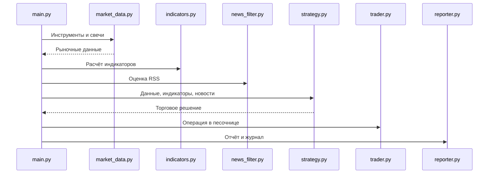

# Архитектура

`main.py` оркестрирует запуск; `market_data.py` работает с API; `indicators.py` содержит расчёты; `strategy.py` формирует решения; `trader.py` отвечает за заявки; `reporter.py` сохраняет результаты.
